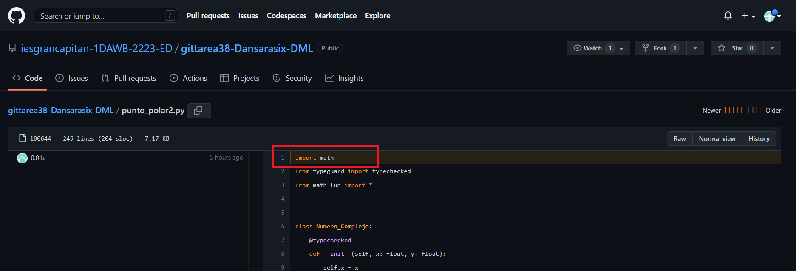

## LAURA LUQUE BRAVO 
## Tarea Git 3.8: Git. Issues

Para realizar esta práctica, primero nos dirigimos a nuestro reposistorio y añadimos un archivo. En mi caso he añadido un archivo tipo Python.
Ahora nos dirigimos al repositorio de nuestro compañero y a un archivo que él ha subido vamos a añadirle un issue referenciando una línea de código y otro issue para que añada información.

Para ello, nos dirigmos al archivo en el cual vamos a añadir el issue, y en la parte derecha marcamos el botón Blame.
Ahora señalamos dónde vamos a añadir el issue referenciando una línea de código, solamente con tocar el número de la línea se nos subraya:

A continuación nos dirigimos al código del archivo nuevamente y en la línea que habíamos subrayadonos aparece unos punto al lado, le damos y selecionamos "Reference in new issue":

Nos aparece ahora una pantalla donde le indicamos el título y un comentario del issue que vamos a añadir. Cuando lo tengamos le damos al botón "Submit new issue":

Una vez creado nos aparecería como la siguiente imagen:

Repetimos los pasos anteriores para añadir el segundo issue.
Una vez lo tengamos, nos dirigimos a Issues y en Label indicamos "bug" para el issue 1 y documentation para el issue 2. Le damos a añadir label y nos aparecería como la siguiente imagen:

Ahora mediante líneas de comandos, vamos a cerrar los issues que nuestro compñaero nos ha indicado en un archivo nuestro.
Nos vamos a la consola y nos dirigimos a la carpeta de la práctica.
Iniciamos git y clonamos nuestro repo:

Vamos a modificar nuestro archivo para corregir los issues que nos ha indicado nuestro compañero, tanto el del código como el de documentación, y así añadirle un commit para cerrar ambos issues.
Una vez modificado,añadimos nuestro archivo a nuestro repositorio.

Se puede ver como en el comentario del commit hemos indicado la palabra close #1 #2. Esto lo que realiza es el cierre de ambos issues a la vez.

Si ahora nos vamos a nuestro repo, podemos ver como ambos issues se han cerrado:

Y en código, podemos ver el commit que hemos indicado:

